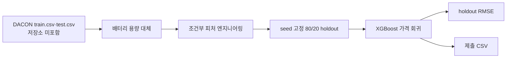

# XGBoost 기반 중고 전기차 가격 예측

[English](README.md)

> [프로젝트 자세히 보기](PORTFOLIO.ko.md)

DACON 중고 전기차 가격 대회를 위한 XGBoost 회귀 워크플로입니다. 배터리 용량 결측을 별도 모델로 대체하고, 가능한 원본 컬럼에서 차량 피처를 만든 뒤 제출 CSV를 작성합니다.

## 분석 흐름



## 구현한 방식

- `src/ev_price_prediction_xgb.py`가 `train.csv`, `test.csv`를 읽고 `가격(백만원)`을 예측합니다.
- 관측된 배터리 용량 행으로 XGBoost 대체 모델을 학습한 뒤, 결측값을 채워 가격 모델에 넘깁니다.
- 제조사·모델·상태 조합, 주행거리·연식 비율, 전비, 구동 방식, 사고 이력 피처는 해당 원본 컬럼이 있을 때만 만듭니다.
- CLI는 seed 고정 80/20 holdout RMSE를 `results/metrics.json`에 저장하고, 전체 학습 데이터로 다시 학습해 `results/submission.csv`를 만듭니다.

## 대회 성적

사용자가 확인한 DACON 정규화 리더보드 RMSE는 **0.919**입니다. 대회 데이터, 제출 CSV, 리더보드 캡처, 생성 결과는 현재 저장소에 없으므로 이 값은 로컬에서 재현할 수 없습니다. CLI가 만든 holdout RMSE는 다른 평가 조건의 수치이며 0.919와 직접 비교하면 안 됩니다.

## 실행

```powershell
python src\ev_price_prediction_xgb.py `
  --train-csv data\train.csv `
  --test-csv data\test.csv
```

원본 DACON 데이터를 내려받아 `data/`에 둔 뒤 필요한 패키지를 설치합니다. 실행하면 `results/submission.csv`와 `results/metrics.json`을 만듭니다.

## 한계와 문서

원본 제출물과 데이터 버전이 없고, 구현한 검증은 단일 무작위 holdout입니다. 대체 방식의 이점·피처 중요도·대회 성적을 독립 재계산할 수 없습니다.

- [포트폴리오 사례 연구](PORTFOLIO.ko.md)
- [프로젝트 리뷰](docs/PROJECT_REVIEW.md)
