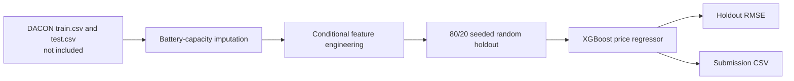

# Used-EV Price Forecasting with XGBoost

[한국어](README.ko.md)

> [Project details](PORTFOLIO.md)

This repository contains an XGBoost regression workflow for a DACON used-EV
price competition. It handles missing battery-capacity values, builds vehicle
features when their source columns are present, and writes a submission CSV.

## Analysis flow



## Implemented approach

- `src/ev_price_prediction_xgb.py` reads the original `train.csv` and
  `test.csv`, then predicts the `가격(백만원)` target.
- An XGBoost regressor imputes missing `배터리용량` values from available
  vehicle fields before model training.
- The pipeline conditionally creates manufacturer/model/state combinations,
  mileage and age ratios, efficiency, drivetrain, and accident-history
  features when the corresponding columns exist.
- The maintained CLI uses a seeded 80/20 random holdout and writes its observed
  RMSE to `results/metrics.json`; it then trains on the full training data and
  writes `results/submission.csv`.

## Reported competition result

The user-confirmed DACON normalized leaderboard RMSE is **0.919**. The
competition data, submission file, leaderboard capture, and generated output
are not retained in this repository, so the leaderboard value cannot be
reproduced locally from the tracked files. A local holdout RMSE generated by
the CLI is a separate metric and should not be compared directly with that
leaderboard result.

## Run

Download the original DACON `train.csv` and `test.csv`, then run:

```powershell
python src\ev_price_prediction_xgb.py `
  --train-csv data\train.csv `
  --test-csv data\test.csv
```

The source data is not included. Install the packages required by the script
before running it; the command writes `results/submission.csv` and
`results/metrics.json`.

## Limitations

- Dataset size, competition rank, and the original submission are not retained.
- The imputation benefit, feature importance, and 0.919 leaderboard result
  cannot be independently recomputed from this checkout.
- The implemented validation is one seeded random holdout; it is not
  cross-validation, time-based validation, or an external test.

## Documentation

- [Portfolio case study](PORTFOLIO.md)
- [Project review](docs/PROJECT_REVIEW.md)
